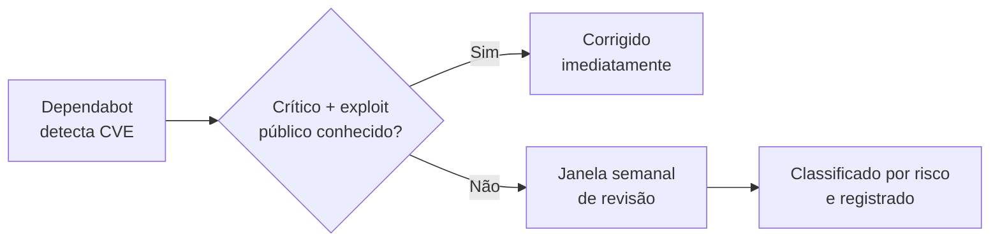
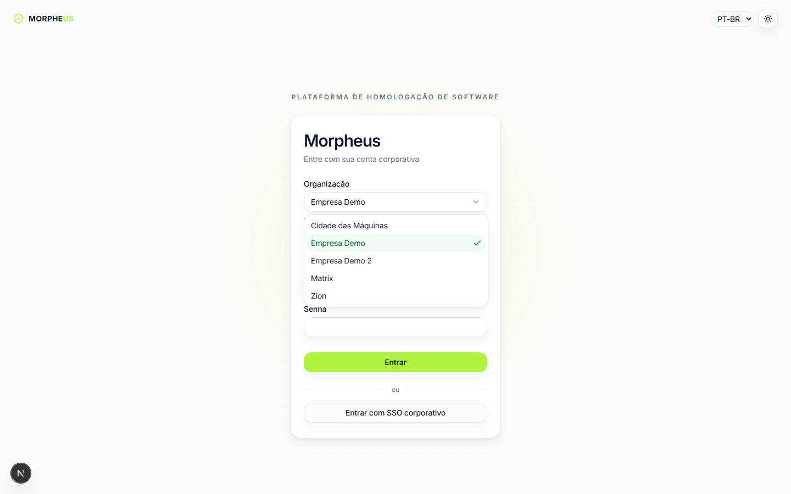
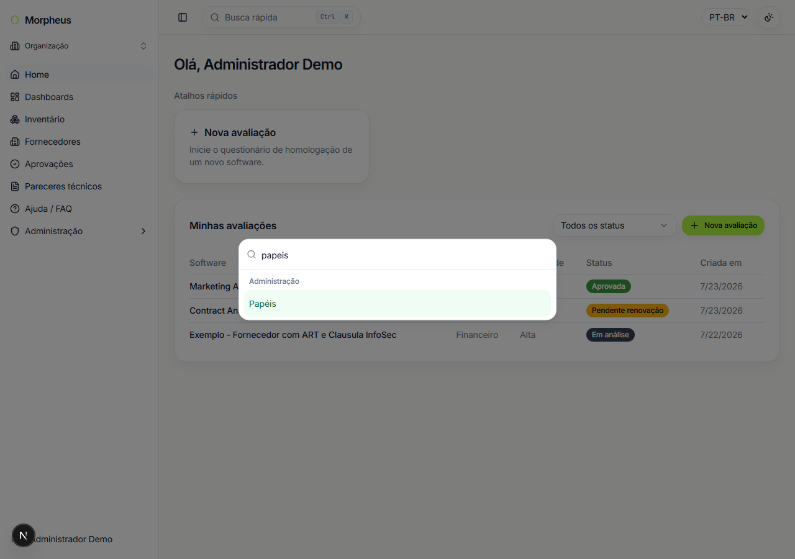
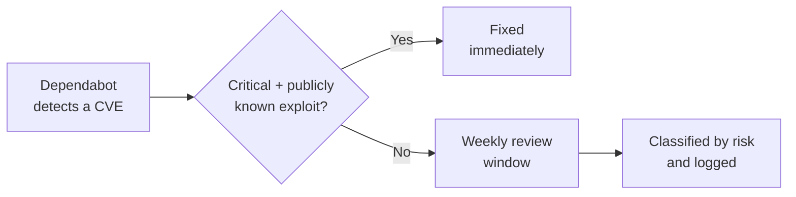
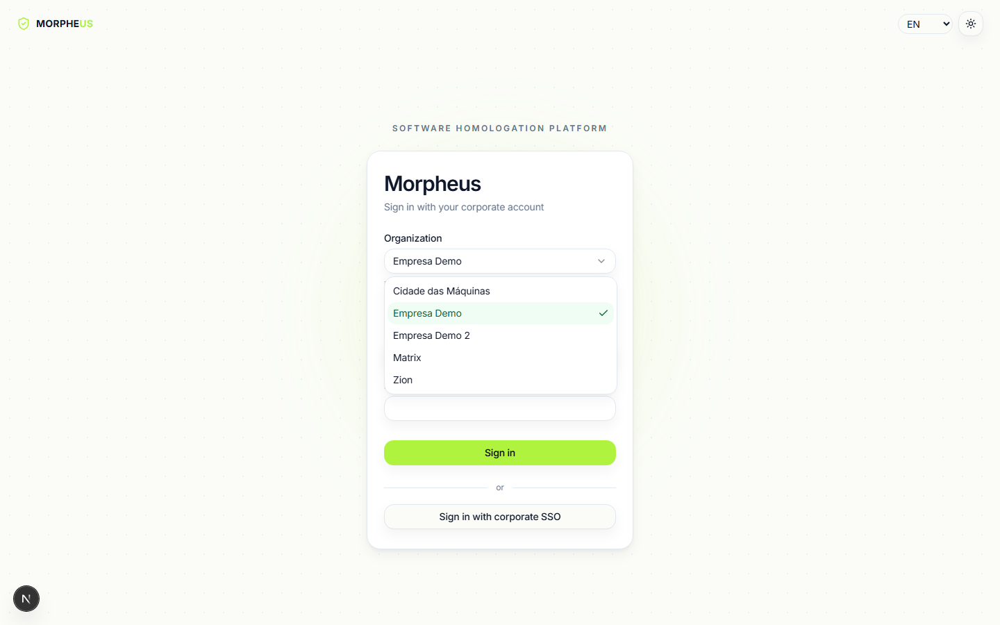
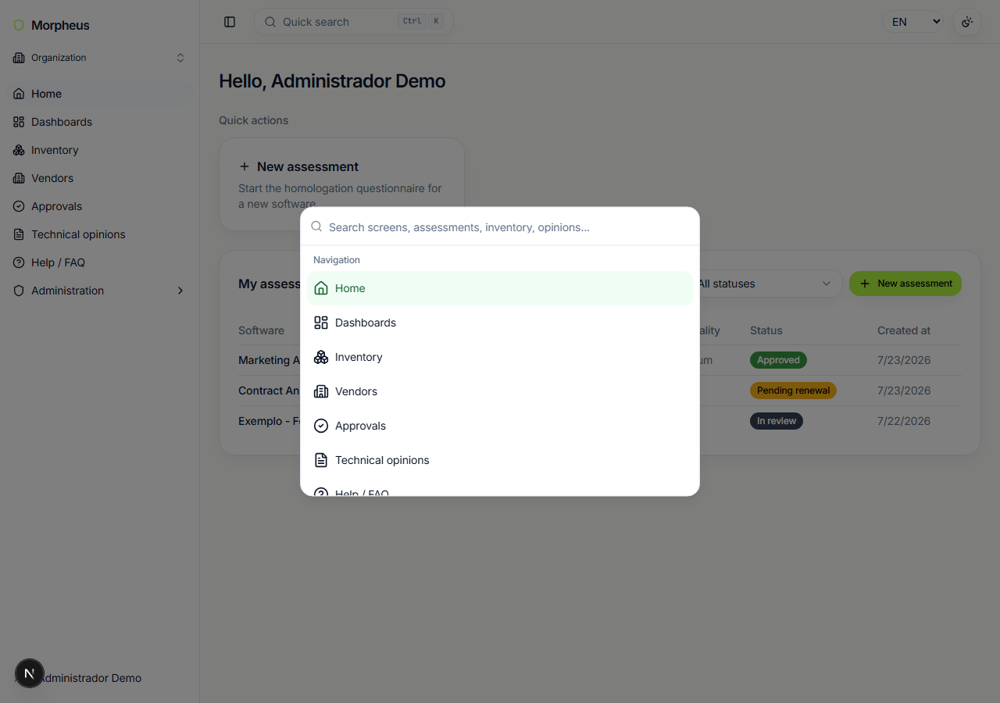

# Morpheus

**Projeto educacional / portfólio.** Não é software em produção nem um produto comercial - foi
construído do zero, etapa por etapa, para praticar (e demonstrar) engenharia full-stack aplicada a
um problema real de segurança da informação, com os controles que um time de blueteam
normalmente cobra de qualquer sistema que lida com dados sensíveis: controle de acesso granular,
trilha de auditoria, hardening de API, observabilidade.

## O que o Morpheus faz

Centraliza a gestão de risco de segurança da informação em duas frentes complementares: o software
adotado pela empresa e o fornecedor por trás dele. Do questionário de risco à decisão final:

1. Questionário de risco (perguntas ponderadas, vinculadas a controles de compliance).
2. Matriz de decisão configurável (faixas de probabilidade × impacto → classificação de risco).
3. Workflow de aprovação com etapas e responsáveis configuráveis por tenant.
4. Parecer técnico em PDF, com QR Code de verificação.
5. Inventário de software homologado, com ciclo de revisão periódica.
6. Dashboards de postura de conformidade e placar de maturidade por área.
7. Avaliação de risco de fornecedores, com questionário inspirado no NIST SP 800-161, pontuação
   automática e Tiers de monitoramento com cadência de reavaliação configurável.

Um efeito direto disso: como toda nova contratação passa por um canal único e fica registrada num
inventário central, o processo também fortalece a governança corporativa e reduz Shadow IT - o
ganho vem de tornar a adoção formal o caminho natural (com dono e trilha de auditoria), não de
detectar ativamente o que já roda às escondidas.

## Matriz de risco (metodologia)

O motor de risco segue uma abordagem clássica de avaliação - probabilidade × impacto - alinhada com
frameworks reconhecidos como o NIST SP 800-30 (*Guide for Conducting Risk Assessments*): cada
pergunta do questionário contribui, com peso próprio, para uma das duas dimensões (ou ambas), e o
resultado é classificado contra faixas configuráveis pelo administrador.

Nada disso é fixo em código. Por tenant, é possível parametrizar quantas faixas de probabilidade e
de impacto existem, como elas se cruzam numa grade de decisão (heatmap), o texto de recomendação e
a cor de cada classificação, e o score mínimo de aprovação - inclusive versionar a matriz inteira
(ativar uma "Matriz Padrão v2" sem perder o histórico das avaliações já decididas contra a versão
anterior).

| Matriz de risco - grade de decisão | Dashboard executivo - postura de conformidade |
| --- | --- |
|  |  |

## Avaliação de risco de fornecedores (metodologia)

Além de homologar o software, um analista interno registra o fornecedor por trás dele e responde um
questionário de 28 perguntas (dados cadastrais/contratuais, política de segurança da informação,
gestão de vulnerabilidades e incidentes, continuidade e disponibilidade) - inspirado nas práticas de
gestão de risco de cadeia de suprimentos do NIST SP 800-161 (*Cybersecurity Supply Chain Risk
Management Practices*). Não é um formulário público: só quem já tem acesso ao Morpheus preenche, com
base em contrato/documentação recebida do fornecedor.

Ao concluir a avaliação, a pontuação é calculada automaticamente (mesmo motor de score do
questionário de software) e classificada num Tier de monitoramento - Tier 1 é o melhor cenário
(menos acompanhamento), Tier 4 o pior (acompanhamento mais próximo). Cada Tier tem um intervalo base
de reavaliação configurável pelo administrador, ajustado pela criticidade de negócio do fornecedor
(de fornecedores críticos, reavaliados com mais frequência, a fornecedores de baixa criticidade,
revisados com menos frequência).

O fornecedor por trás de um software já homologado também é rastreável: a partir do detalhe de
qualquer item do inventário é possível ver a ART do fornecedor vinculado (ou iniciar uma, se ainda
não existir), e a aba "Acompanhamento" em Fornecedores dá uma visão consolidada de quem nunca foi
avaliado ou está com reavaliação vencida/próxima.

| ART do fornecedor no detalhe do item | Acompanhamento de fornecedores |
| --- | --- |
|  |  |

## Controles de segurança implementados

- **RBAC granular por permissão** (não só por papel), com decorators dedicados para composição
  AND/OR de permissões - `apps/api/src/common/decorators`, `common/guards`.
- **Autenticação**: JWT de acesso curto + refresh token via cookie httpOnly, SSO via SAML
  genérico/plugável (login local convive com SSO, nunca exclusivo).
- **Trilha de auditoria**: interceptor dedicado registra CREATE/UPDATE/DELETE/LOGIN/... com ator,
  entidade e IP, consultável em `/admin/audit-logs`.
- **CSRF via double-submit cookie**, sanitização global de entrada, rate limiting configurável por
  endpoint (`@nestjs/throttler`, limites mais estritos em rotas sensíveis).
- **Criptografia em repouso (AES-256-GCM)** para campos sensíveis via `CryptoService`.
- **Observabilidade**: logs estruturados, correlation ID, métricas Prometheus, tracing
  OpenTelemetry.
- **Multi-tenancy row-level**, isolamento por `tenantId` em toda query, banco único - com acesso
  cross-organização restrito a super-admins (permissão dedicada + trilha de auditoria própria),
  sem afetar o isolamento padrão de nenhum outro usuário.

**Isso também vale para o próprio repositório**, não só para o produto: CI obrigatório, branch
protection e uma janela semanal combinada de revisão de vulnerabilidades (Dependabot).



Processo completo (camadas de risco, histórico de cada janela) em
[`docs/security.md`](./docs/security.md).

## Telas

| Minha visão | Administrativo |
| --- | --- |
|  |  |

| Executivo | Placar por área |
| --- | --- |
|  |  |

| Login - seleção de organização | Busca rápida (Cmd/Ctrl+K) |
| --- | --- |
|  |  |

| Administração - gestão de papéis |
| --- |
|  |

## Stack

| Camada          | Tecnologia                                                             |
| --------------- | ----------------------------------------------------------------------- |
| Backend         | Node.js, TypeScript, NestJS 11                                          |
| Frontend        | Next.js 16 (App Router), React 19, TailwindCSS 4, shadcn/ui              |
| Banco de dados  | PostgreSQL 16, Prisma ORM 7                                              |
| Autenticação    | JWT + Refresh Token, SSO via SAML genérico/plugável                     |
| Observabilidade | Logs estruturados (pino), Correlation ID, métricas Prometheus, OpenTelemetry |
| Containerização | Docker, Docker Compose                                                   |
| IaC             | Terraform (deploy AWS documentado - nunca aplicado contra conta real)   |

## Rodando localmente

```bash
cp .env.example .env
pnpm install
docker compose -f docker-compose.dev.yml up -d
pnpm db:migrate
pnpm db:seed
pnpm dev
```

- Web: http://localhost:3000 - API: http://localhost:3001 (Swagger em `/docs`)
- Login de teste: tenant `demo`, `admin@morpheus.demo`, senha `Demo@12345` (só existe porque o seed
  cria esse usuário - nunca use esse padrão para usuários reais).

Passo a passo completo (incluindo a stack via Docker) em
[`docs/DEVELOPMENT.md`](./docs/DEVELOPMENT.md#como-rodar).

A API é documentada via Swagger/OpenAPI (`@nestjs/swagger`), disponível em `/docs` com o servidor
local rodando - toda rota, DTO e esquema de autenticação (Bearer JWT) gerado automaticamente a
partir do código, não mantido à parte. Pensado para facilitar integrações futuras: qualquer time
que precise consumir a API tem ali um contrato navegável e sempre atualizado, sem depender deste
README ou de documentação escrita à mão.

## Documentação técnica completa

- [`docs/DEVELOPMENT.md`](./docs/DEVELOPMENT.md) - referência enxuta: stack, estrutura, como rodar,
  CI/proteção do `main`.
- [`docs/CHANGELOG.md`](./docs/CHANGELOG.md) - histórico de decisões etapa a etapa/PR a PR, mantido
  de propósito como um diário de bordo técnico (não só uma lista de features prontas): trade-offs
  considerados, bugs reais encontrados e como foram corrigidos.
- [`docs/architecture.md`](./docs/architecture.md) - diagramas de modelo de dados e topologia de
  deploy.
- [`docs/security.md`](./docs/security.md) - SSDLC: CI, branch protection, Dependabot e o processo
  de revisão semanal de vulnerabilidades.
- [`infra/terraform/README.md`](./infra/terraform/README.md) - estratégia de deploy em produção.

## Contato

[LinkedIn](https://www.linkedin.com/in/domcabral/) - domcabral@proton.me

---

# Morpheus (English)

**Educational / portfolio project.** Not production software or a commercial product - built from
scratch, stage by stage, to practice (and demonstrate) full-stack engineering applied to a real
information-security problem, with the controls a blue team typically expects from any system
handling sensitive data: granular access control, audit trail, API hardening, observability.

## What Morpheus does

Centralizes information-security risk management on two complementary fronts: the software adopted
by the company and the vendor behind it. From risk questionnaire to final decision:

1. Risk questionnaire (weighted questions, linked to compliance controls).
2. Configurable decision matrix (probability × impact ranges → risk classification).
3. Approval workflow with configurable steps and responsible roles per tenant.
4. Technical opinion (PDF report), with a verification QR code.
5. Homologated software inventory, with periodic review cycle.
6. Compliance-posture dashboards and a maturity leaderboard by area.
7. Vendor risk assessment, with a questionnaire inspired by NIST SP 800-161, automatic scoring, and
   monitoring Tiers with configurable reassessment cadence.

A direct side effect: since every new acquisition goes through a single channel and lands in a
central inventory, the process also strengthens corporate governance and reduces Shadow IT - the
gain comes from making formal adoption the natural path (with an owner and an audit trail), not
from actively detecting what's already running under the radar.

## Risk matrix (methodology)

The risk engine follows a classic likelihood × impact assessment approach, aligned with recognized
frameworks such as NIST SP 800-30 (*Guide for Conducting Risk Assessments*): each questionnaire
question contributes, with its own weight, to one of the two dimensions (or both), and the result
is classified against admin-configurable bands.

None of this is hardcoded. Per tenant, you can configure how many probability and impact bands
exist, how they intersect in a decision grid (heatmap), each classification's recommendation text
and color, and the minimum approval score - including versioning the whole matrix (activate a
"Standard Matrix v2" without losing the history of assessments already decided against the
previous version).

| Risk matrix - decision grid | Executive dashboard - compliance posture |
| --- | --- |
|  |  |

## Vendor risk assessment (methodology)

Beyond homologating the software itself, an internal analyst registers the vendor behind it and
answers a 28-question questionnaire (registration/contractual data, information security policy,
vulnerability and incident management, continuity and availability) - inspired by the supply-chain
risk management practices in NIST SP 800-161 (*Cybersecurity Supply Chain Risk Management
Practices*). It's not a public form: only users who already have Morpheus access fill it in, based
on the contract/documentation received from the vendor.

Once the assessment is completed, the score is calculated automatically (the same scoring engine
used for the software questionnaire) and classified into a monitoring Tier - Tier 1 is the best-case
scenario (least oversight), Tier 4 the worst (closest oversight). Each Tier has an admin-configurable
base reassessment interval, adjusted by the vendor's business criticality (critical vendors get
reassessed more often, low-criticality vendors less often).

The vendor behind an already-homologated piece of software is traceable too: from any inventory
item's detail page you can see the linked vendor's ART (or start one, if it doesn't exist yet), and
the "Tracking" tab under Vendors gives a consolidated view of who's never been assessed or has an
overdue/upcoming reassessment.

| Vendor ART on the item detail page | Vendor tracking |
| --- | --- |
|  |  |

## Implemented security controls

- **Granular, permission-level RBAC** (not just role-level), with dedicated decorators for AND/OR
  permission composition - `apps/api/src/common/decorators`, `common/guards`.
- **Authentication**: short-lived access JWT + refresh token via httpOnly cookie, SSO via generic/
  pluggable SAML (local login coexists with SSO, never exclusive).
- **Audit trail**: a dedicated interceptor logs CREATE/UPDATE/DELETE/LOGIN/... with actor, entity
  and IP, queryable at `/admin/audit-logs`.
- **CSRF via double-submit cookie**, global input sanitization, configurable rate limiting per
  endpoint (`@nestjs/throttler`, stricter limits on sensitive routes).
- **Encryption at rest (AES-256-GCM)** for sensitive fields via `CryptoService`.
- **Observability**: structured logs, correlation ID, Prometheus metrics, OpenTelemetry tracing.
- **Row-level multi-tenancy**, `tenantId` isolation on every query, single database - with
  cross-organization access restricted to super-admins (dedicated permission + its own audit
  trail), without affecting the default isolation of any other user.

**This also applies to the repository itself**, not just the product: mandatory CI, branch
protection, and an agreed weekly vulnerability-review window (Dependabot).



Full process (risk tiers, per-window history) in [`docs/security.md`](./docs/security.md)
(Portuguese).

## Screenshots

| My view | Admin |
| --- | --- |
|  |  |

| Executive | Leaderboard |
| --- | --- |
|  |  |

| Login - organization picker | Quick search (Cmd/Ctrl+K) |
| --- | --- |
|  |  |

| Admin - role management |
| --- |
|  |

## Stack

| Layer            | Technology                                                                |
| ---------------- | -------------------------------------------------------------------------- |
| Backend          | Node.js, TypeScript, NestJS 11                                             |
| Frontend         | Next.js 16 (App Router), React 19, TailwindCSS 4, shadcn/ui                 |
| Database         | PostgreSQL 16, Prisma ORM 7                                                 |
| Authentication   | JWT + Refresh Token, generic/pluggable SAML SSO                            |
| Observability    | Structured logs (pino), Correlation ID, Prometheus metrics, OpenTelemetry   |
| Containerization | Docker, Docker Compose                                                     |
| IaC              | Terraform (AWS deploy documented - never applied against a real account)   |

## Running locally

```bash
cp .env.example .env
pnpm install
docker compose -f docker-compose.dev.yml up -d
pnpm db:migrate
pnpm db:seed
pnpm dev
```

- Web: http://localhost:3000 - API: http://localhost:3001 (Swagger at `/docs`)
- Test login: tenant `demo`, `admin@morpheus.demo`, password `Demo@12345` (exists only because the
  seed creates this user - never use this pattern for real users).

Full walkthrough (including the Docker stack) in
[`docs/DEVELOPMENT.md`](./docs/DEVELOPMENT.md#como-rodar) (Portuguese - the project's technical log
is written in Portuguese; happy to translate specific sections on request).

The API is documented via Swagger/OpenAPI (`@nestjs/swagger`), available at `/docs` with the local
server running - every route, DTO and the authentication scheme (Bearer JWT) is generated
automatically from the code, not maintained separately. Meant to ease future integrations: any
team that needs to consume the API gets a browsable, always-current contract there, without
depending on this README or hand-written documentation.

## Full technical documentation

- [`docs/DEVELOPMENT.md`](./docs/DEVELOPMENT.md) - lean reference: stack, structure, how to run,
  CI/`main` branch protection.
- [`docs/CHANGELOG.md`](./docs/CHANGELOG.md) - stage-by-stage/PR-by-PR decision log, deliberately
  kept as a technical logbook (not just a feature list): trade-offs considered, real bugs found and
  how they were fixed.
- [`docs/architecture.md`](./docs/architecture.md) - data model and deployment topology diagrams.
- [`docs/security.md`](./docs/security.md) - SSDLC: CI, branch protection, Dependabot, and the
  weekly vulnerability-review process (Portuguese).
- [`infra/terraform/README.md`](./infra/terraform/README.md) - production deployment strategy.

## Contact

[LinkedIn](https://www.linkedin.com/in/domcabral/) - domcabral@proton.me
