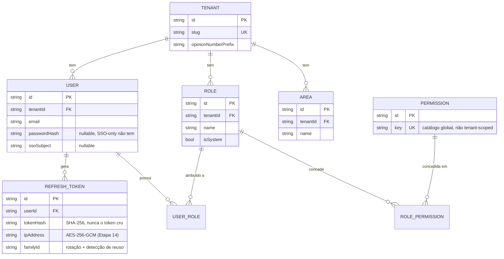
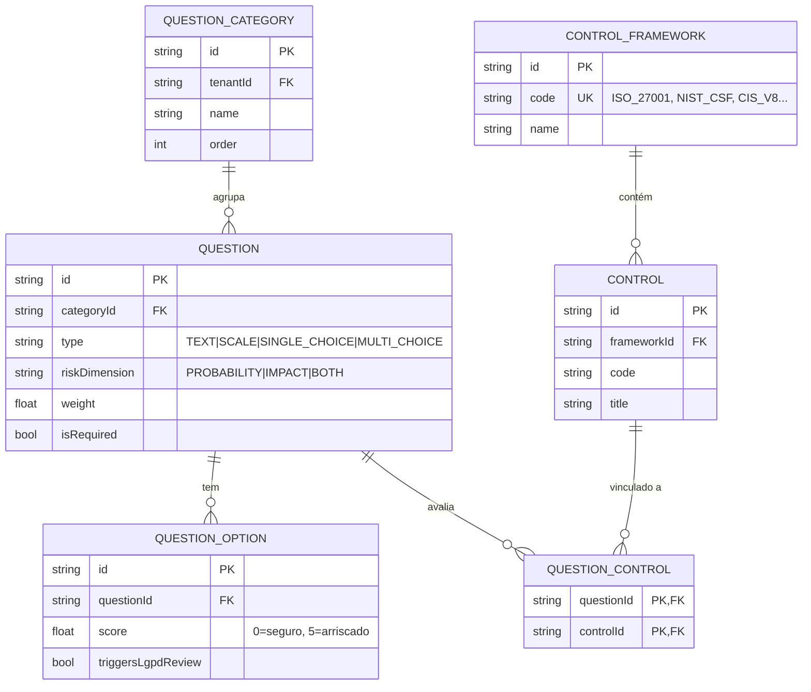
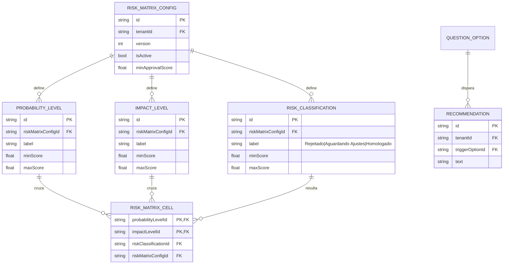
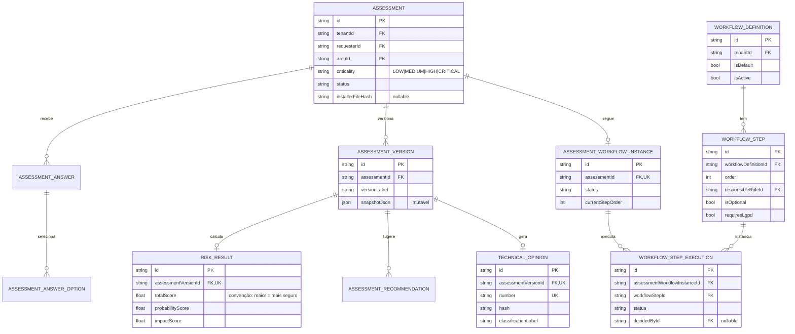
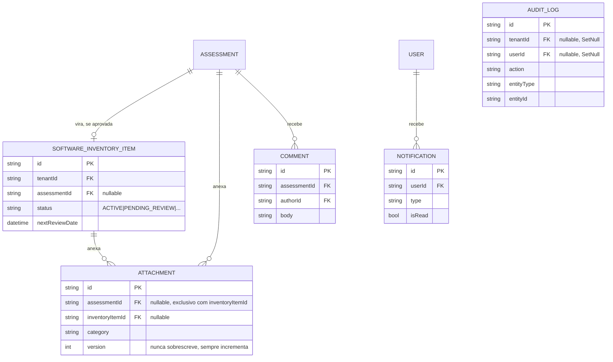
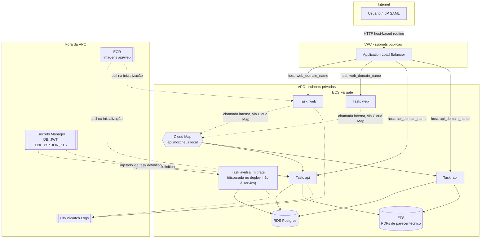

# Arquitetura

Diagramas de referência do schema de dados e da topologia de deploy em produção. Complementam o
[`docs/DEVELOPMENT.md`](./DEVELOPMENT.md) (que documenta as decisões etapa a etapa) - aqui o foco é
a visão estrutural.

## Modelo de dados (ER)

36 modelos no total ([`packages/database/prisma/schema.prisma`](../packages/database/prisma/schema.prisma))
- agrupados por domínio abaixo, não num diagrama só, porque um ER de 36 entidades numa imagem só
vira ilegível. Cada diagrama mostra os campos que importam para entender a relação (chaves e um ou
dois campos identificadores), não o schema completo - consulte o `.prisma` para a lista exata de
colunas/constraints.

### Tenancy e RBAC

### Questionário e biblioteca de controles

### Motor de risco (matriz configurável)

### Avaliação e workflow de aprovação

### Pós-aprovação, documentos e auditoria

## Topologia de deploy (produção, AWS)

Ver [`infra/terraform/`](../infra/terraform/) para o código - este diagrama é a leitura visual da
mesma infraestrutura descrita no README daquela pasta.

