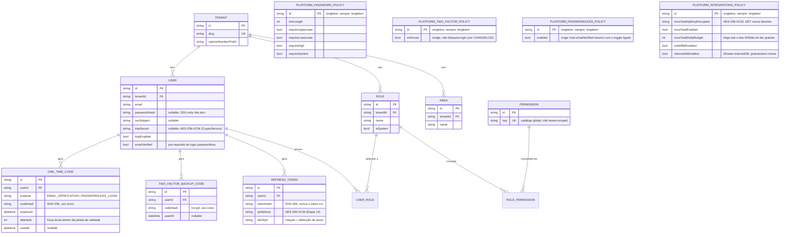
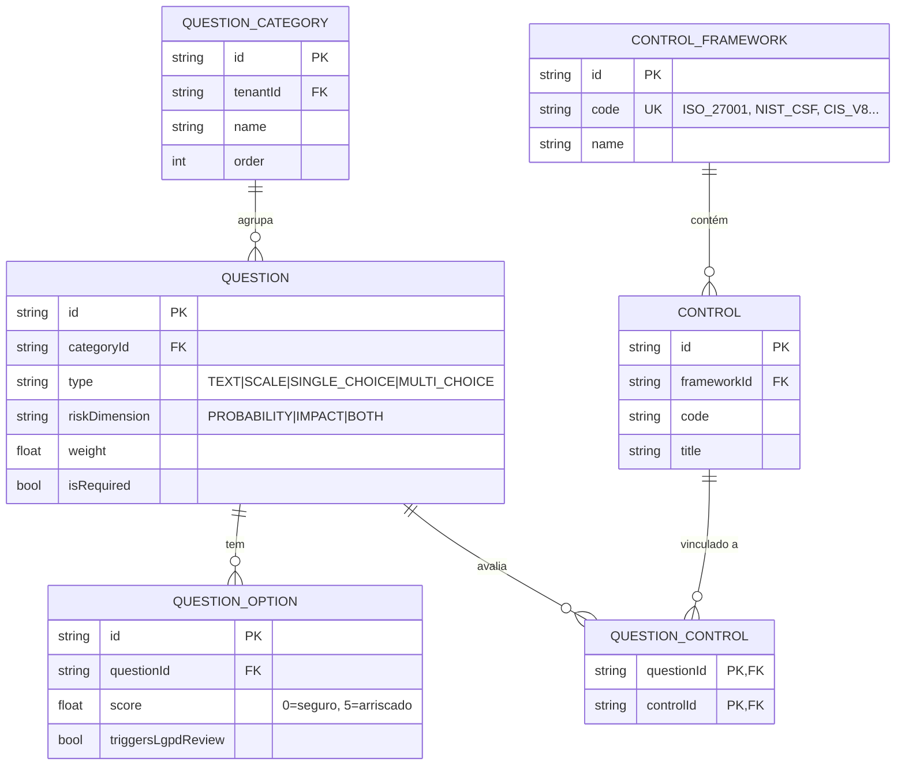
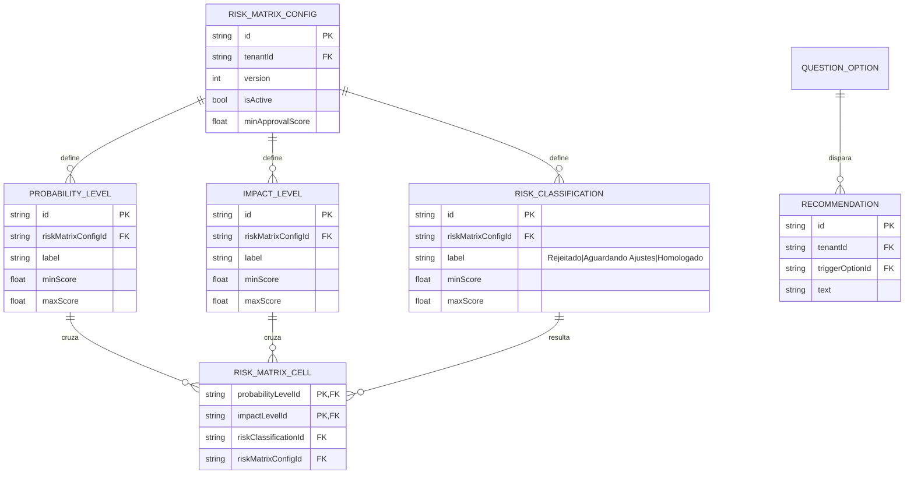
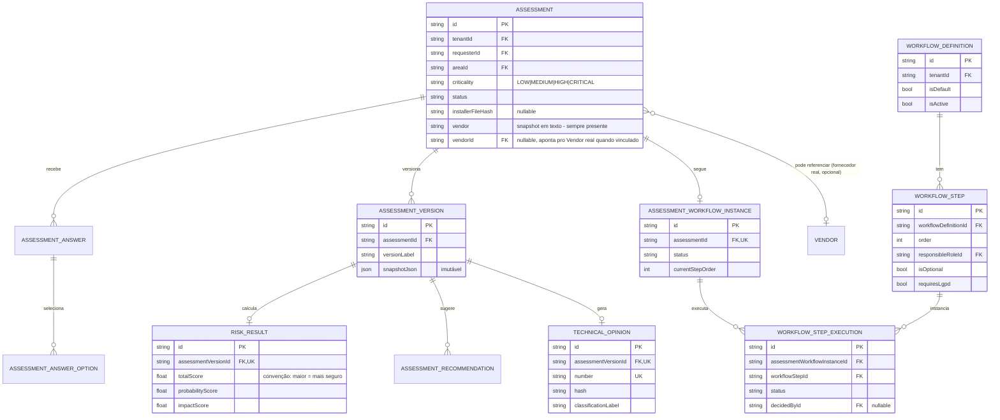
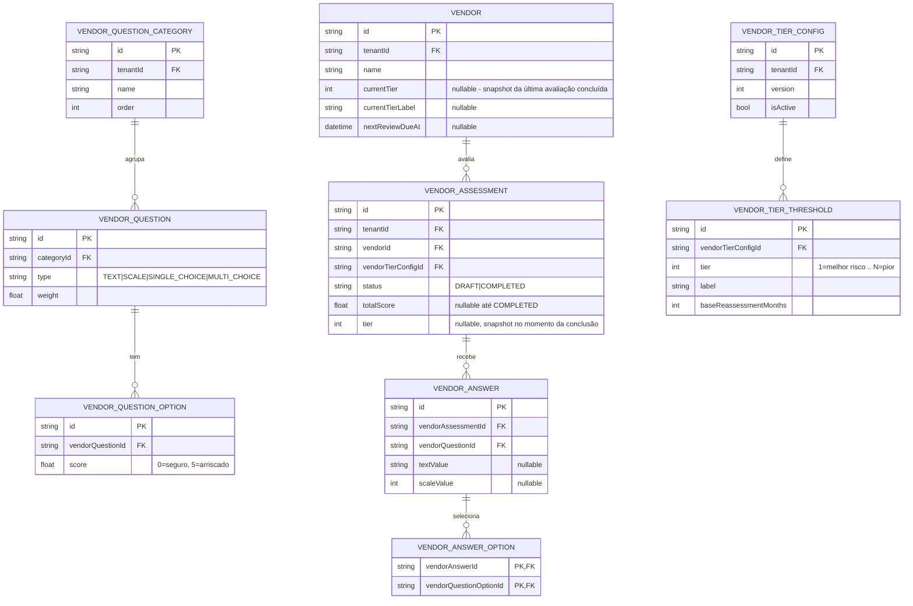
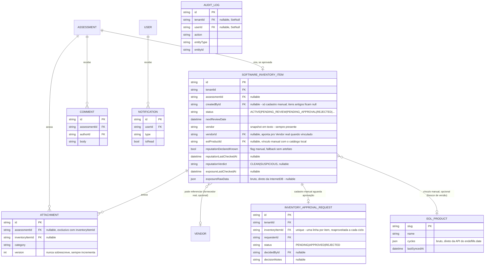
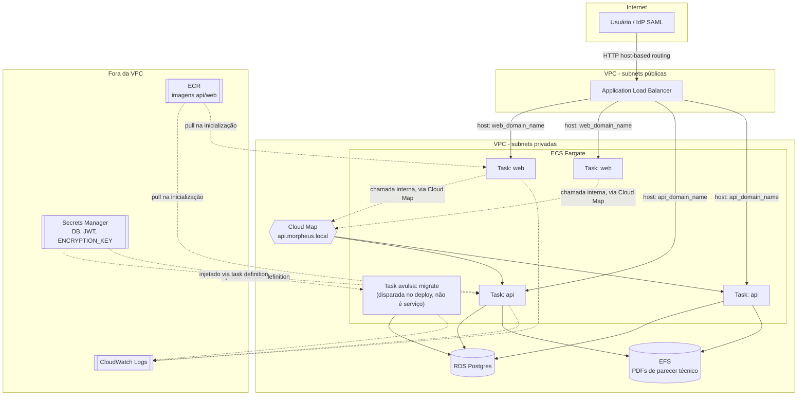

# Arquitetura

Diagramas de referência do schema de dados e da topologia de deploy em produção. Complementam o
[`docs/DEVELOPMENT.md`](./DEVELOPMENT.md) (referência de setup) e [`docs/CHANGELOG.md`](./CHANGELOG.md)
(decisões etapa a etapa) - aqui o foco é a visão estrutural.

## Modelo de dados (ER)

52 modelos no total ([`packages/database/prisma/schema.prisma`](../packages/database/prisma/schema.prisma))
- agrupados por domínio abaixo, não num diagrama só, porque um ER de 47 entidades numa imagem só
vira ilegível. Cada diagrama mostra os campos que importam para entender a relação (chaves e um ou
dois campos identificadores), não o schema completo - consulte o `.prisma` para a lista exata de
colunas/constraints.

### Tenancy e RBAC

```mermaid
erDiagram
    TENANT ||--o{ AREA : tem
    TENANT ||--o{ ROLE : tem
    TENANT ||--o{ USER : tem
    ROLE ||--o{ ROLE_PERMISSION : concede
    PERMISSION ||--o{ ROLE_PERMISSION : "concedida em"
    USER ||--o{ USER_ROLE : possui
    ROLE ||--o{ USER_ROLE : "atribuído a"
    USER ||--o{ REFRESH_TOKEN : gera
    USER ||--o{ TWO_FACTOR_BACKUP_CODE : gera
    USER ||--o{ ONE_TIME_CODE : gera

    TENANT {
        string id PK
        string slug UK
        string opinionNumberPrefix
    }
    AREA {
        string id PK
        string tenantId FK
        string name
    }
    PERMISSION {
        string id PK
        string key UK "catálogo global, não tenant-scoped"
    }
    ROLE {
        string id PK
        string tenantId FK
        string name
        bool isSystem
    }
    USER {
        string id PK
        string tenantId FK
        string email
        string passwordHash "nullable, SSO-only não tem"
        string ssoSubject "nullable"
        string totpSecret "nullable, AES-256-GCM (CryptoService)"
        bool totpEnabled
        bool emailVerified "pré-requisito de login passwordless"
    }
    REFRESH_TOKEN {
        string id PK
        string userId FK
        string tokenHash "SHA-256, nunca o token cru"
        string ipAddress "AES-256-GCM (Etapa 14)"
        string familyId "rotação + detecção de reuso"
    }
    TWO_FACTOR_BACKUP_CODE {
        string id PK
        string userId FK
        string codeHash "bcrypt, uso único"
        datetime usedAt "nullable"
    }
    ONE_TIME_CODE {
        string id PK
        string userId FK
        string purpose "EMAIL_VERIFICATION | PASSWORDLESS_LOGIN"
        string codeHash "SHA-256, uso único"
        datetime expiresAt
        int attempts "força bruta dentro da janela de validade"
        datetime usedAt "nullable"
    }
    PLATFORM_PASSWORD_POLICY {
        string id PK "singleton, sempre 'singleton'"
        int minLength
        bool requireUppercase
        bool requireLowercase
        bool requireDigit
        bool requireSymbol
    }
    PLATFORM_TWO_FACTOR_POLICY {
        string id PK "singleton, sempre 'singleton'"
        bool enforced "nudge, não bloqueia login (ver CHANGELOG)"
    }
    PLATFORM_PASSWORDLESS_POLICY {
        string id PK "singleton, sempre 'singleton'"
        bool enabled "exige User.emailVerified mesmo com o toggle ligado"
    }
    PLATFORM_INTEGRATIONS_POLICY {
        string id PK "singleton, sempre 'singleton'"
        string virusTotalApiKeyEncrypted "AES-256-GCM, GET nunca devolve"
        bool virusTotalEnabled
        int virusTotalDailyBudget "folga sob o teto 500/dia do tier gratuito"
        bool endoflifeEnabled
        bool internetDbEnabled "Shodan InternetDB, gratuita/sem chave"
    }
```

`PLATFORM_PASSWORD_POLICY`, `PLATFORM_TWO_FACTOR_POLICY`, `PLATFORM_PASSWORDLESS_POLICY` e
`PLATFORM_INTEGRATIONS_POLICY` não têm nenhuma relação no diagrama de propósito: são, junto de
`PERMISSION`, os únicos models do sistema que são cross-tenant em vez de tenant-scoped - uma única
linha cada, configuráveis só por quem tem a permissão `platform:cross-tenant`, valendo para todos os
tenants.

### Questionário e biblioteca de controles

`CONTROL` também é referenciado pelo questionário de fornecedor via `VENDOR_QUESTION_CONTROL`
(mesma junção `QUESTION_CONTROL`, mas para `VENDOR_QUESTION`) - omitido deste diagrama pelo mesmo
motivo que nenhum diagrama aqui cruza contextos (ex.: `VendorAssessment.performedById` também não
aparece desenhado na seção de Fornecedores), ver diagrama da seção "Fornecedores e tierização".

```mermaid
erDiagram
    QUESTION_CATEGORY ||--o{ QUESTION : agrupa
    QUESTION ||--o{ QUESTION_OPTION : tem
    QUESTION ||--o{ QUESTION_CONTROL : avalia
    CONTROL_FRAMEWORK ||--o{ CONTROL : contém
    CONTROL ||--o{ QUESTION_CONTROL : "vinculado a"

    QUESTION_CATEGORY {
        string id PK
        string tenantId FK
        string name
        int order
    }
    QUESTION {
        string id PK
        string categoryId FK
        string type "TEXT|SCALE|SINGLE_CHOICE|MULTI_CHOICE"
        string riskDimension "PROBABILITY|IMPACT|BOTH"
        float weight
        bool isRequired
    }
    QUESTION_OPTION {
        string id PK
        string questionId FK
        float score "0=seguro, 5=arriscado"
        bool triggersLgpdReview
    }
    CONTROL_FRAMEWORK {
        string id PK
        string code UK "ISO_27001, NIST_CSF, CIS_V8..."
        string name
    }
    CONTROL {
        string id PK
        string frameworkId FK
        string code
        string title
    }
    QUESTION_CONTROL {
        string questionId PK,FK
        string controlId PK,FK
    }
```

### Motor de risco (matriz configurável)

```mermaid
erDiagram
    RISK_MATRIX_CONFIG ||--o{ PROBABILITY_LEVEL : define
    RISK_MATRIX_CONFIG ||--o{ IMPACT_LEVEL : define
    RISK_MATRIX_CONFIG ||--o{ RISK_CLASSIFICATION : define
    PROBABILITY_LEVEL ||--o{ RISK_MATRIX_CELL : cruza
    IMPACT_LEVEL ||--o{ RISK_MATRIX_CELL : cruza
    RISK_CLASSIFICATION ||--o{ RISK_MATRIX_CELL : resulta
    QUESTION_OPTION ||--o{ RECOMMENDATION : dispara

    RISK_MATRIX_CONFIG {
        string id PK
        string tenantId FK
        int version
        bool isActive
        float minApprovalScore
    }
    PROBABILITY_LEVEL {
        string id PK
        string riskMatrixConfigId FK
        string label
        float minScore
        float maxScore
    }
    IMPACT_LEVEL {
        string id PK
        string riskMatrixConfigId FK
        string label
        float minScore
        float maxScore
    }
    RISK_CLASSIFICATION {
        string id PK
        string riskMatrixConfigId FK
        string label "Rejeitado|Aguardando Ajustes|Homologado"
        float minScore
        float maxScore
    }
    RISK_MATRIX_CELL {
        string probabilityLevelId PK,FK
        string impactLevelId PK,FK
        string riskClassificationId FK
        string riskMatrixConfigId FK
    }
    RECOMMENDATION {
        string id PK
        string tenantId FK
        string triggerOptionId FK
        string text
    }
```

### Avaliação e workflow de aprovação

```mermaid
erDiagram
    ASSESSMENT ||--o{ ASSESSMENT_ANSWER : recebe
    ASSESSMENT_ANSWER ||--o{ ASSESSMENT_ANSWER_OPTION : seleciona
    ASSESSMENT ||--o{ ASSESSMENT_VERSION : versiona
    ASSESSMENT_VERSION ||--o| RISK_RESULT : calcula
    ASSESSMENT_VERSION ||--o{ ASSESSMENT_RECOMMENDATION : sugere
    ASSESSMENT_VERSION ||--o| TECHNICAL_OPINION : gera
    ASSESSMENT ||--o| ASSESSMENT_WORKFLOW_INSTANCE : segue
    WORKFLOW_DEFINITION ||--o{ WORKFLOW_STEP : tem
    ASSESSMENT_WORKFLOW_INSTANCE ||--o{ WORKFLOW_STEP_EXECUTION : executa
    WORKFLOW_STEP ||--o{ WORKFLOW_STEP_EXECUTION : instancia
    ASSESSMENT }o--o| VENDOR : "pode referenciar (fornecedor real, opcional)"

    ASSESSMENT {
        string id PK
        string tenantId FK
        string requesterId FK
        string areaId FK
        string criticality "LOW|MEDIUM|HIGH|CRITICAL"
        string status
        string installerFileHash "nullable"
        string vendor "snapshot em texto - sempre presente"
        string vendorId FK "nullable, aponta pro Vendor real quando vinculado"
    }
    ASSESSMENT_VERSION {
        string id PK
        string assessmentId FK
        string versionLabel
        json snapshotJson "imutável"
    }
    RISK_RESULT {
        string id PK
        string assessmentVersionId FK,UK
        float totalScore "convenção: maior = mais seguro"
        float probabilityScore
        float impactScore
    }
    WORKFLOW_DEFINITION {
        string id PK
        string tenantId FK
        bool isDefault
        bool isActive
    }
    WORKFLOW_STEP {
        string id PK
        string workflowDefinitionId FK
        int order
        string responsibleRoleId FK
        bool isOptional
        bool requiresLgpd
    }
    ASSESSMENT_WORKFLOW_INSTANCE {
        string id PK
        string assessmentId FK,UK
        string status
        int currentStepOrder
    }
    WORKFLOW_STEP_EXECUTION {
        string id PK
        string assessmentWorkflowInstanceId FK
        string workflowStepId FK
        string status
        string decidedById FK "nullable"
    }
    TECHNICAL_OPINION {
        string id PK
        string assessmentVersionId FK,UK
        string number UK
        string hash
        string classificationLabel
    }
```

### Fornecedores e tierização (avaliação de risco de fornecedores)

Catálogo e motor de score deliberadamente **separados** dos de software acima - a tierização de
fornecedores é um score agregado 1D (não uma matriz probabilidade×impacto 2D), reaproveita só a
função pura de cálculo (`RiskEngineService.computeScores`), não as tabelas. Sem workflow de
aprovação: `VendorAssessment` calcula e fecha sozinha ao ser concluída. `VENDOR_QUESTION` também se
vincula à biblioteca de controles compartilhada (`CONTROL`, ver seção "Questionário e biblioteca de
controles") via `VENDOR_QUESTION_CONTROL` - mesmo controle pode ser avaliado tanto por uma pergunta
de software quanto de fornecedor.

```mermaid
erDiagram
    VENDOR ||--o{ VENDOR_ASSESSMENT : avalia
    VENDOR_QUESTION_CATEGORY ||--o{ VENDOR_QUESTION : agrupa
    VENDOR_QUESTION ||--o{ VENDOR_QUESTION_OPTION : tem
    VENDOR_ASSESSMENT ||--o{ VENDOR_ANSWER : recebe
    VENDOR_ANSWER ||--o{ VENDOR_ANSWER_OPTION : seleciona
    VENDOR_TIER_CONFIG ||--o{ VENDOR_TIER_THRESHOLD : define

    VENDOR {
        string id PK
        string tenantId FK
        string name
        int currentTier "nullable - snapshot da última avaliação concluída"
        string currentTierLabel "nullable"
        datetime nextReviewDueAt "nullable"
    }
    VENDOR_QUESTION_CATEGORY {
        string id PK
        string tenantId FK
        string name
        int order
    }
    VENDOR_QUESTION {
        string id PK
        string categoryId FK
        string type "TEXT|SCALE|SINGLE_CHOICE|MULTI_CHOICE"
        float weight
    }
    VENDOR_QUESTION_OPTION {
        string id PK
        string vendorQuestionId FK
        float score "0=seguro, 5=arriscado"
    }
    VENDOR_TIER_CONFIG {
        string id PK
        string tenantId FK
        int version
        bool isActive
    }
    VENDOR_TIER_THRESHOLD {
        string id PK
        string vendorTierConfigId FK
        int tier "1=melhor risco .. N=pior"
        string label
        int baseReassessmentMonths
    }
    VENDOR_ASSESSMENT {
        string id PK
        string tenantId FK
        string vendorId FK
        string vendorTierConfigId FK
        string status "DRAFT|COMPLETED"
        float totalScore "nullable até COMPLETED"
        int tier "nullable, snapshot no momento da conclusão"
    }
    VENDOR_ANSWER {
        string id PK
        string vendorAssessmentId FK
        string vendorQuestionId FK
        string textValue "nullable"
        int scaleValue "nullable"
    }
    VENDOR_ANSWER_OPTION {
        string vendorAnswerId PK,FK
        string vendorQuestionOptionId PK,FK
    }
```

### Pós-aprovação, documentos e auditoria

```mermaid
erDiagram
    ASSESSMENT ||--o| SOFTWARE_INVENTORY_ITEM : "vira, se aprovada"
    ASSESSMENT ||--o{ ATTACHMENT : anexa
    SOFTWARE_INVENTORY_ITEM ||--o{ ATTACHMENT : anexa
    ASSESSMENT ||--o{ COMMENT : recebe
    USER ||--o{ NOTIFICATION : recebe
    SOFTWARE_INVENTORY_ITEM }o--o| VENDOR : "pode referenciar (fornecedor real, opcional)"
    SOFTWARE_INVENTORY_ITEM ||--o| INVENTORY_APPROVAL_REQUEST : "cadastro manual aguarda aprovação"
    SOFTWARE_INVENTORY_ITEM }o--o| EOL_PRODUCT : "vínculo manual, opcional (frescor de versão)"

    SOFTWARE_INVENTORY_ITEM {
        string id PK
        string tenantId FK
        string assessmentId FK "nullable"
        string createdById FK "nullable - só cadastro manual; itens antigos ficam null"
        string status "ACTIVE|PENDING_REVIEW|PENDING_APPROVAL|REJECTED|..."
        datetime nextReviewDate
        string vendor "snapshot em texto - sempre presente"
        string vendorId FK "nullable, aponta pro Vendor real quando vinculado"
        string eolProductId FK "nullable, vínculo manual com o catálogo local"
        bool reputationDeclaredKnown "flag manual, fallback sem artefato"
        datetime reputationLastCheckedAt "nullable"
        string reputationVerdict "CLEAN|SUSPICIOUS, nullable"
        datetime exposureLastCheckedAt "nullable"
        json exposureRawData "bruto, direto da InternetDB - nullable"
    }
    EOL_PRODUCT {
        string slug PK
        string name
        json cycles "bruto, direto da API do endoflife.date"
        datetime lastSyncedAt
    }
    INVENTORY_APPROVAL_REQUEST {
        string id PK
        string tenantId FK
        string inventoryItemId FK "unique - uma linha por item, reaproveitada a cada ciclo"
        string requesterId FK
        string status "PENDING|APPROVED|REJECTED"
        string decidedById FK "nullable"
        string decisionNotes "nullable"
    }
    ATTACHMENT {
        string id PK
        string assessmentId FK "nullable, exclusivo com inventoryItemId"
        string inventoryItemId FK "nullable"
        string category
        int version "nunca sobrescreve, sempre incrementa"
    }
    COMMENT {
        string id PK
        string assessmentId FK
        string authorId FK
        string body
    }
    AUDIT_LOG {
        string id PK
        string tenantId FK "nullable, SetNull"
        string userId FK "nullable, SetNull"
        string action
        string entityType
        string entityId
    }
    NOTIFICATION {
        string id PK
        string userId FK
        string type
        bool isRead
    }
```

## Topologia de deploy (produção, AWS)

Ver [`infra/terraform/`](../infra/terraform/) para o código - este diagrama é a leitura visual da
mesma infraestrutura descrita no README daquela pasta.

```mermaid
flowchart TB
    subgraph Internet
        Client[Usuário / IdP SAML]
    end

    subgraph "VPC - subnets públicas"
        ALB[Application Load Balancer]
    end

    subgraph "VPC - subnets privadas"
        subgraph "ECS Fargate"
            API1[Task: api]
            API2[Task: api]
            WEB1[Task: web]
            WEB2[Task: web]
            MIGRATE["Task avulsa: migrate\n(disparada no deploy, não é serviço)"]
        end
        EFS[(EFS\nPDFs de parecer técnico)]
        RDS[(RDS Postgres)]
        CloudMap{{"Cloud Map\napi.morpheus.local"}}
    end

    subgraph "Fora da VPC"
        ECR[[ECR\nimagens api/web]]
        Secrets[[Secrets Manager\nDB, JWT, ENCRYPTION_KEY]]
        CW[[CloudWatch Logs]]
    end

    Client -->|HTTP host-based routing| ALB
    ALB -->|host: web_domain_name| WEB1
    ALB -->|host: web_domain_name| WEB2
    ALB -->|host: api_domain_name| API1
    ALB -->|host: api_domain_name| API2

    WEB1 -.->|chamada interna, via Cloud Map| CloudMap
    WEB2 -.->|chamada interna, via Cloud Map| CloudMap
    CloudMap --> API1
    CloudMap --> API2

    API1 --> RDS
    API2 --> RDS
    MIGRATE --> RDS

    API1 --> EFS
    API2 --> EFS

    ECR -.->|pull na inicialização| API1
    ECR -.->|pull na inicialização| WEB1
    Secrets -.->|injetado via task definition| API1
    Secrets -.->|injetado via task definition| MIGRATE
    API1 -.-> CW
    WEB1 -.-> CW
    MIGRATE -.-> CW
```
