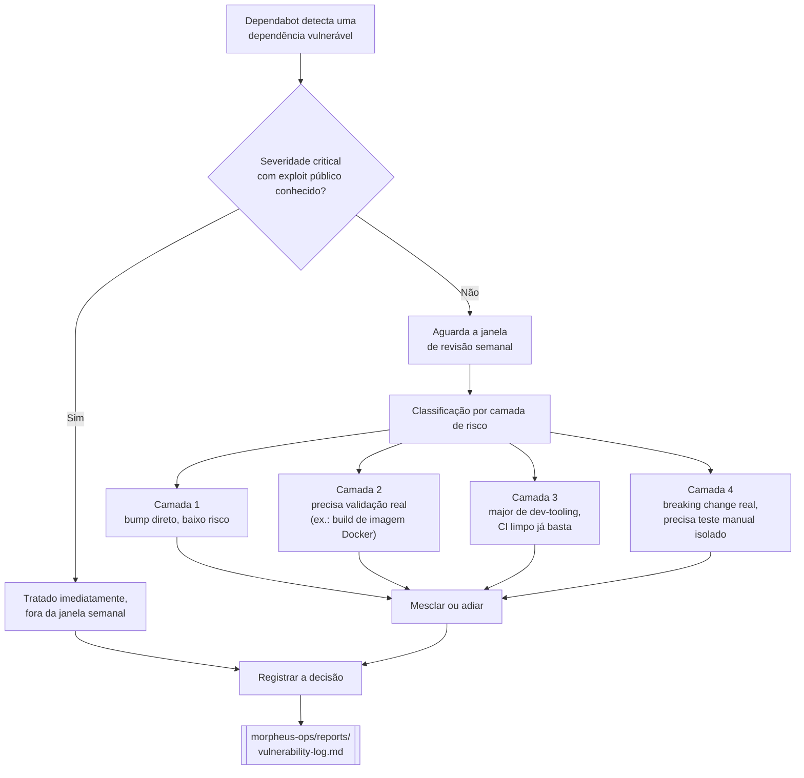

# Segurança e SSDLC

Como o Morpheus aplica *Security by Design* ao próprio ciclo de desenvolvimento - não só como
feature do produto (RBAC, auditoria, criptografia em repouso, ver
[`README.md`](../README.md#controles-de-segurança-implementados)), mas como prática do dia a dia de
manter o repositório. Esta página documenta o **processo**; o histórico de decisões e bugs reais
encontrados montando esse processo está no [`CHANGELOG.md`](./CHANGELOG.md).

## O que está ativo

- **CI obrigatório** (`.github/workflows/ci.yml`): todo PR roda `typecheck`/`lint`/`test`/`build`.
  Branch protection em `main` exige esse check verde antes de mesclar - inclusive para o dono do
  repositório, sem bypass silencioso.
- **Dependabot**: alerts de vulnerabilidade + correções de segurança automáticas (ambos nativos do
  GitHub, sem custo) + atualizações de versão semanais (`.github/dependabot.yml`).
- **Janela de revisão semanal**: decisão combinada de não mesclar PRs de segurança do Dependabot
  assim que aparecem - eles se acumulam e são revisados juntos, uma vez por semana, com uma válvula
  de escape para o que não pode esperar.

## Ciclo de vida de uma vulnerabilidade

As quatro camadas de risco não são um framework fixo - são o jeito prático que a primeira janela de
revisão real (2026-07-26) usou pra separar "mesclar sem pensar duas vezes" de "isso merece atenção
de verdade", e ficaram como referência para as próximas.

## Janela de revisão semanal, na prática

Cada janela passa pelos PRs de segurança abertos pelo Dependabot e:

1. Cruza os alertas abertos (`gh api .../dependabot/alerts`) com os PRs disponíveis - várias vezes
   um único bump (ex. um patch do Next.js) resolve vários alertas de uma vez.
2. Classifica cada PR na camada de risco correspondente (acima).
3. Mescla o que for baixo risco na hora; PRs redundantes (o mesmo pacote/versão já coberto por um
   PR maior que acabou de ser mesclado) são fechados manualmente com uma nota - o Dependabot nem
   sempre fecha sozinho.
4. O que precisa de mais cuidado (build real, teste manual de breaking change) fica para a próxima
   janela, deliberadamente - não é esquecido, é adiado com registro do motivo.
5. **Válvula de escape**: severidade `critical` com exploit publicamente conhecido não espera a
   janela - é tratada na hora em que aparece.

## Onde fica o histórico

Cada janela é registrada em detalhe (o que foi encontrado, como foi classificado, o que foi mesclado
vs. adiado e por quê) em
[`morpheus-ops/reports/vulnerability-log.md`](https://github.com/domcabral9/morpheus-ops/blob/main/reports/vulnerability-log.md) -
um repositório separado dedicado a documentação operacional/segurança, para manter estado
operacional que muda toda semana fora do código e da narrativa de desenvolvimento deste repositório.
O mesmo repositório também mantém
[`reports/component-inventory.md`](https://github.com/domcabral9/morpheus-ops/blob/main/reports/component-inventory.md),
um inventário gerado automaticamente de toda dependência/versão/imagem em uso - a base usada para
avaliar upgrades e downgrades antes de uma janela.
